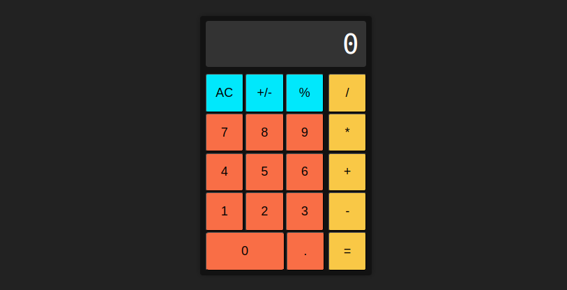

# foundations-calculator
An in-browser (simple) calculator

# Preview

    

# Links

-[Assignment Page (Dec '23)](https://www.theodinproject.com/lessons/foundations-calculator)

-[Finished Project](https://github.com/ErreurDeSyntaxe/foundations-calculator)

# Notable Features

-"Clear" button  
-"+/-" button  
-Decimal point button  
-Percentage button  
-Chainable operation buttons  (9 + 1 * 3 = 30)

# Challenges

-The decimal point in JavaScript  
-Chaining multiple operations  
-User-proofing the arithmetic buttons  

# Lessons

-Don't trust JavaScript numbers  

# Diary

How much time did I waste on the decimal issue? Why do JavaScript numbers 
behave so weirdly? 4/100/100 = 0.0003999999???

I had to rewrite completely the function that called upon operate(). I am 
unsure what mistake I had written in, but rewriting it was relatively easy,
and it fixed the problem I had. At the time of writing, I don't recall what said
problem was. This is a lesson in writing frequent diary entries, the same way
that I already learned to commit often. 